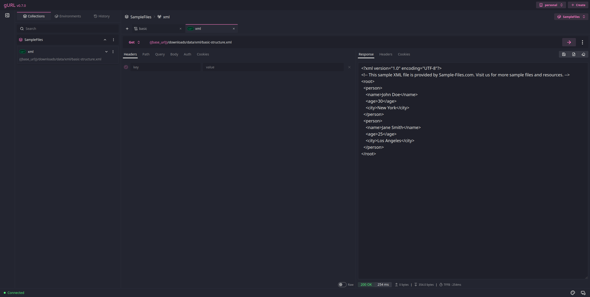
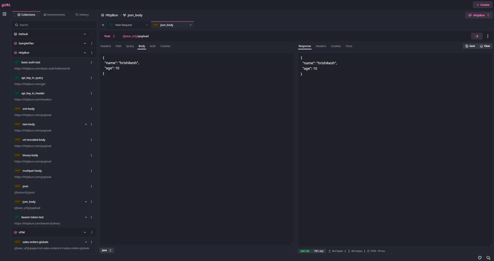
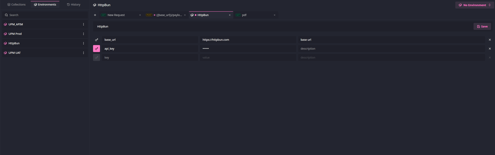
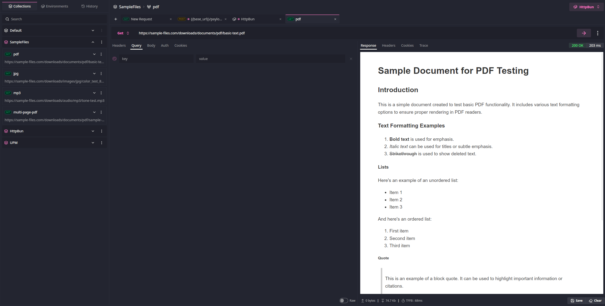
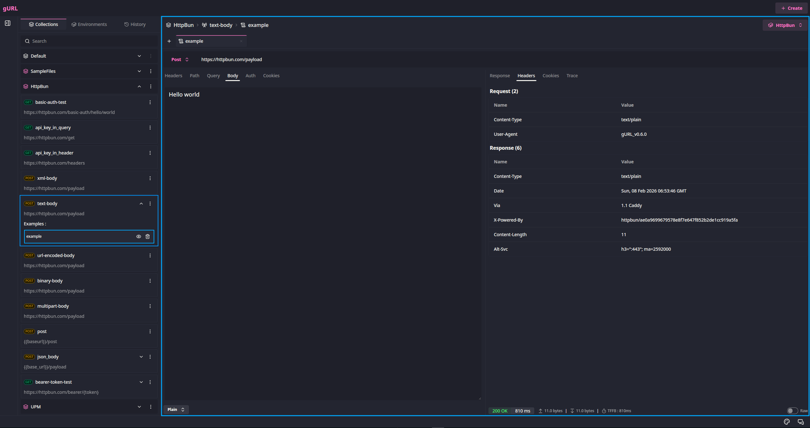
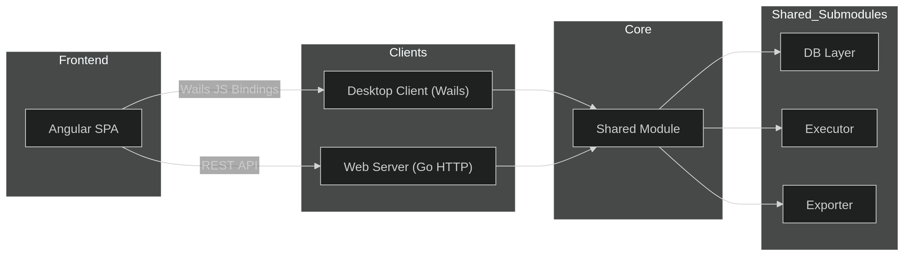
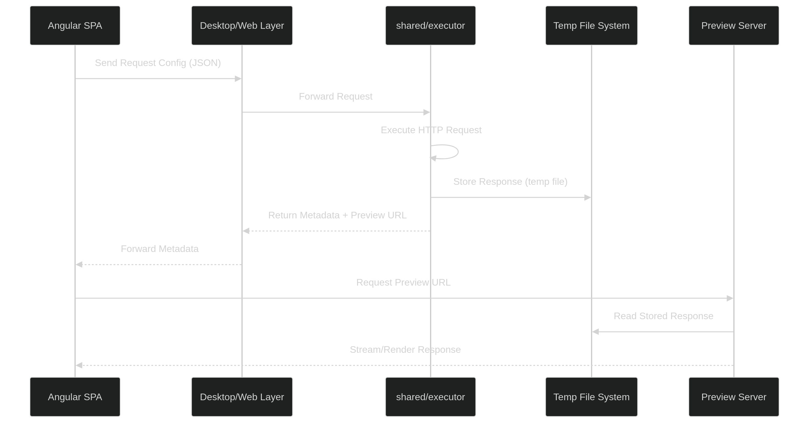

 

  
  
Cross platform API Client

## About
gURL is just another fancy cURL. I am building this because I want to learn Go & desktop app development using Wails, plus it's something that is useful in my
day-to-day work.

> Declaimer: Entire is code is written by me, no LLMs were used to write any of the code.

## Features

It's still in early stage, essential features are implemented. 

* Simple UI to configure HTTP Requests
* Workspaces to organize different orgs
* Request history
* Request collections
* Environments
* Request examples
* Response preview for supported media types (Images, Audio, Video, Pdfs etc)
* Import & Export
* Linux & Mac Os supported, Windows support in progress
* Web client is also present, can be self hosted

## Screenshots

<figure>
  <figcaption align="center"><h3>Web Client</h3></figcaption>
  
</figure>

<figure>
  <figcaption align="center"><h3>Collections</h3></figcaption>
  
</figure>

<figure>
  <figcaption align="center"><h3>Environments</h3></figcaption>
  
</figure>

<figure>
  <figcaption align="center"><h3>Response Previews</h3></figcaption>
  
</figure>

<figure>
  <figcaption align="center"><h3>Response Example</h3></figcaption>
  
</figure>

## Architecture 

This project is designed with a shared core + multiple clients architecture. The goal is to keep all business logic centralized while allowing different frontends (desktop and web) to reuse the same underlying functionality.

<figure>
  
  <figcaption align="center"><h3>High Level Design</h3></figcaption>
</figure>

### Design Principles

- **Shared Core**:  business logic shared avoiding duplication.
- **Platform agnostic frontend**: dynamically switches implementations based on runtime environment.
- **Thin Clients**: Client modules act as thin wrappers on top of shared core.
- **Separation of Concerns**: Clear boundaries between,
    - UI (`frontend/`)
    - Transport (`/desktop`, `/web`)
    - Business Logic (`shared/`)

### Modules

`desktop/` 
- A standalone Go module built using Wails.
- Acts as the desktop client.
- Integrates the Angular frontend via Wails.
- Communicates with the frontend through Wails JS bindings.
- Reuses all core logic from the shared/ module.

`web/`
- A Go module that uses the standard net/http package.
- Exposes RESTful APIs for backend operations
- Serves the Angular SPA (static files)
- Also depends on the shared/ module for all core functionality.

`shared/`
- The core module containing all reusable business logic.
- Designed to be platform-agnostic and shared across both desktop and web clients.
- Submodules
  
  `db/`
    - Repository layer for interacting with SQLite.
    - Handles persistence and data access.
  
  `assets/`
    - **embeds static assets** in the final binary
  
  `executor/`
    - Responsible for **executing HTTP requests**.
    - Includes logic for request handling, response parsing, and detection.

  `import_export`
    - Handles **import/export** functionality.
    - Supports Workspace, collections, requests, environment exports to `.json` & imports from `.json`
  
`frontend/`
- Angular SPA
- Built with **Program to interface** architecture:
- Declares abstractions for Storage, Executor, Exporter. 
- Provides concrete implementations based on runtime environment
  | Environment | Implementation Strategy     |
  | ----------- | --------------------------- |
  | Web         | Calls backend via REST APIs |
  | Desktop     | Uses Wails JS bindings      |

- allows the same frontend codebase to work in both desktop & client mode and can be extended further.

### Request Flow 

<figure>
  
</figure>

## Roadmap

- [ ] Importing Open API 2.0, 3.0 and 3.1 specs as usable collections
- [ ] Oauth 1.0 & 2.0 authorization support.
- [ ] WSS, GRPC, SOAP support.
- [ ] pre & post scripts.
- [ ] Mock server
- [ ] Git integration
- [ ] Web Hooks testing & replayability
- [ ] Ability to execute collections and add tests
- [ ] OAS generation

## Acknowledgments

* [Wails Project](https://wails.io/)
* [Angular V21](https://angular.dev/)
* [Daisy UI](https://daisyui.com/)
* [Lucide Icons](https://lucide.dev/)
* [Sqlite](https://sqlite.org/index.html)
* [GORM](https://gorm.io/)
* [mime-db](https://github.com/jshttp/mime-db)
* [nanoid](https://github.com/ai/nanoid)
* [go-nanoid](https://github.com/matoous/go-nanoid)
* [Biome](https://biomejs.dev/)

## License

MIT
